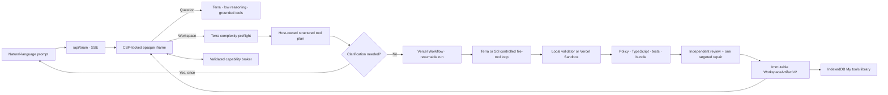

# FinDex — Your money, your tools

FinDex is a Brain-first, AI-native personal finance demo. Finance is personal: other apps ship a fixed dashboard; FinDex keeps your spending, portfolio, income, and cash flow in one picture, then lets you **Ask**, **Decide**, or **Build** a tool that fits how *you* track money—and keep it in **My tools**.

The public demo is an anonymous, single-user synthetic ledger (Jordan Lee). It never asks for bank credentials, moves money, executes trades, or presents model output as individualized financial advice.


## Product surfaces

1. **Financial Brain** (`/demo/brain`) — default home. Page-aware Getting started guidance, Ask / Decide / Build help, grounded insight cards, purchase decision checks, and a natural-language tool builder with durable progress.
2. **Spending** (`/demo/spending`) — searchable, filterable activity; recurring list and calendar; plain-language insight; Ask the Brain handoff.
3. **Portfolio and net worth** (`/demo/portfolio`) — four reconciled synthetic U.S. accounts, holdings, allocation vs target, history, contributions, IRS references.
4. **Income and cash flow** (`/demo/cash-flow`) — 30/60/90-day projections, reserve-protected safe-to-spend, transparent assumptions, account runway, decision CTA.
5. **My tools** — FinDex durably plans, builds, validates, reviews, versions, and publishes isolated finance-native React tools (draft first, then verified) inside the Brain drawer.

Cross-cutting UX: shared shell with desktop sidebar + mobile bottom nav, view transitions between money views, Brain handoff banners when you Ask from a detail page, and comfortable typography throughout.

The frozen ledger prompt remains:

> How much did I spend on dining out last month?

FinDex answers **$366.21 across 8 Dining transactions, June 1–30, 2026**, with provenance and a deterministic comparison to May.

## Architecture



There is no widget-kind enum, FIRE scaffold, generated-source fallback, or browser-side compiler. A narrow host-owned intent router keeps ordinary questions out of the paid tool planner but never chooses a calculator kind. Draft tools can publish for interaction while background validation continues; a failed verified polish leaves the last good version in place and reports the real diagnostic.

Detailed references:

- [Architecture and repository boundaries](docs/ARCHITECTURE.md)
- [Financial Brain build policy and operations](docs/FINANCIAL_BRAIN_BUILDS.md)
- [Isolated tool runtime security](docs/SECURITY.md)
- [Testing and release verification](docs/TESTING.md)
- [Demo and release runbook](docs/DEMO_RUNBOOK.md)
- [Contribution guidelines](CONTRIBUTING.md)

## Repository layout

```text
app/                              Next.js UI and API entry points
components/{brain,dashboard,workspaces}/
                                  Feature-oriented React components
lib/{brain,finance,workspaces}/   Contracts and domain/application services
infrastructure/workspace-sandbox/ Pinned hosted/local build template
scripts/                          Data, screenshot, and snapshot operations
tests/{unit,integration,e2e,evaluations}/
                                  Verification by boundary and cost
docs/                             Architecture, security, testing, and runbooks
```

## Host-owned GPT-5.6 routing

Terra is the default for Q&A, complexity assessment, standard planning, and ordinary builds. Sol handles complex planning/building, every independent review, and the single targeted repair. Planning allows at most two paid attempts; building allows the initial pass plus one repair. Independent deadlines keep every Function step below 300 seconds, while Vercel Workflow gives the full run a 20-minute ceiling and resumable indexed progress. The exact routing, retry, deadline, and failure matrix lives in [Financial Brain workspace builds](docs/FINANCIAL_BRAIN_BUILDS.md).

The server raises build policy from declared capabilities and persistence requirements without paying for a redundant re-plan. Model, effort, attempt, response state, token usage, validation, and timings are recorded in each artifact’s collapsed technical provenance.

## Security boundary

- The builder can only list, read, write, exactly patch, or delete bounded `src/**/*.ts`, `tsx`, and CSS files, run a trusted check, and finish. It has no arbitrary shell tool.
- Imports are limited to pinned React, ReactDOM, Recharts, Lucide, date-fns, relative source, and `@findex/workspace-sdk`.
- Static validation rejects path escapes, dynamic imports, network APIs, browser storage, parent/document/window access, unsafe HTML, nested frames, scripts, forms, runtime evaluation, external CSS URLs, source over 256 KB, and bundles over 2 MB.
- Hosted checks use a pinned Vercel Sandbox snapshot with `networkPolicy: "deny-all"`. OpenAI and provider credentials never enter generated files or the sandbox.
- Published code runs as a precompiled IIFE in `<iframe sandbox="allow-scripts">`, without `allow-same-origin`, under CSP that denies connections, navigation, objects, forms, media, and external resources.
- A one-time `MessageChannel` connects the iframe to the trusted host. All RPC payloads are validated and checked against a signed, session- and artifact-bound capability grant.

## Capabilities

Generated applications can request only capabilities granted by their structured plan:

- demo-ledger snapshot, transactions, recurring obligations, forecast, portfolio, and cash flow;
- Twelve Data symbol search, quotes, and time series;
- cited OpenAI web research;
- bounded Findex AI analysis over supplied context;
- namespaced IndexedDB state and controlled JSON/CSV export.

Provider failures remain explicit and timestamped. Mock values are never substituted or labeled as live data. Quotes cache for 60 seconds, time series for 15 minutes, and research for 30 minutes. The anonymous demo limits capability calls, expensive AI/research actions, and builds per session.

## Local setup

Requirements: Node.js 22.13+ and npm.

```bash
npm install
cp .env.example .env.local
npm run dev
```

Open [http://localhost:3000](http://localhost:3000) and choose **Try the demo**. Deterministic ledger questions work without credentials. Generative builds require `OPENAI_API_KEY`; missing credentials return an explicit failure and never a sample tool.

Local builds use an isolated temporary directory with the same fixed TypeScript, bundle, Vitest, Chromium interaction, responsive screenshot, and review path as hosted builds:

```bash
WORKSPACE_EXECUTION_MODE=local npm run dev
```

## Hosted sandbox setup

Authenticate or link the Vercel project, then create the pinned dependency snapshot once:

```bash
npm run sandbox:snapshot
```

Copy the printed `VERCEL_SANDBOX_SNAPSHOT_ID` into the Vercel environment. Snapshot creation temporarily allows the npm registry and Playwright's Chromium CDN for the pinned install, then switches networking to deny-all, typechecks, bundles, runs Vitest and Chromium, and snapshots the verified toolchain. Every user build starts from that immutable snapshot and remains network-denied.

## Environment

All credentials are server-only; none uses a `NEXT_PUBLIC_` prefix.

| Variable | Purpose |
| --- | --- |
| `OPENAI_API_KEY` | Adaptive planning, generation, review, grounded answers, runtime AI, and cited research |
| `TWELVE_DATA_API_KEY` | Server-side symbol, quote, and time-series data |
| `WORKSPACE_EXECUTION_MODE` | `auto`, `local`, `vercel`, or `disabled`; auto selects Vercel in production |
| `VERCEL_SANDBOX_SNAPSHOT_ID` | Pinned hosted validation/build image |
| `DEMO_SESSION_SECRET` | HMAC signing for anonymous sessions, clarification/run access tokens, and artifact grants |
| `DEMO_AS_OF`, `DEMO_SEED` | Deterministic ledger regeneration inputs |

## Brain and artifact interfaces

`POST /api/brain` accepts bounded history, optional active-version source context, and optional clarification answers. It streams:

- `assistant_delta`
- `build_progress`
- `tool_result`
- `insight_card`
- `clarification_required`
- `workspace_started`
- `workspace_published`
- `workspace_failed`

`workspace_started` supplies a signed, session-bound run handle. IndexedDB stores only that run ID, access token, and last consumed event index. The UI resumes from `GET /api/brain/runs/[runId]/events`, recovers terminal output from `GET /api/brain/runs/[runId]`, and cancels with `POST /api/brain/runs/[runId]/cancel`.

`WorkspaceArtifactV2` contains project/version lineage, prompt, plan, multi-file source, compiled JS/CSS and content hash, a server signature, manifest, capability grants, state schema, validation/review results, adaptive model/effort stage traces, per-phase timings, token usage, repair count, and a signed broker token.

`POST /api/workspace/capability` revalidates the session, artifact ID, signed grant, exact capability, rate limit, and capability-specific Zod input before touching ledger, market, web-search, or AI services.

## Browser persistence

Projects, immutable versions, bundles, and namespaced generated-tool state use IndexedDB. Only the active project ID stays in `localStorage`. Restore creates a new head version rather than deleting newer history. Storage usage is checked on load and after publication; the UI warns at 80% and never silently evicts user work.

## Data invariants

Regenerate the stable demo ledger with:

```bash
npm run seed -- --seed findex-2026 --as-of 2026-07-19
```

Money is signed integer cents and dates are ISO date-only values. Schema v2 verifies balance reconciliation, references, unique transactions, investment-account/holding totals, 10,000 allocation basis points, the portfolio-history endpoint, complete net worth, payroll/after-tax contribution treatment, balanced transfers, calendar-month dining coverage, and future cash liabilities. Transfers affect balances but are excluded from spending/income totals.

## Verification

```bash
npm run typecheck
npm test
npm run lint
npm run build
npm run test:e2e
npm run test:local-sandbox
npm run verify:local
```

The regular suite covers finance reconciliation and purchase classification, host-owned effort floors, multi-file policy and bundling, signed grants, portfolio/cash-flow capabilities, missing-provider states, IndexedDB versions/state, explicit no-fallback behavior, messaging ban-list and copy contracts, routed desktop/mobile journeys (including Try the demo → Brain / My tools), screenshot goldens for brand heroes, axe accessibility scans, responsive reflow, iframe isolation, interaction, and reload persistence.

The opt-in live corpus contains more than 40 diverse, ambiguous, out-of-scope, and adversarial prompts. It plans all prompts and builds a configurable sample (three by default):

```bash
RUN_LIVE_GENERATION_EVALS=1 LIVE_EVAL_BUILD_LIMIT=3 npm run test:gen-eval
```

The JSON report is written to ignored `test-results/generative-eval.json`.

With release credentials configured, smoke-test OpenAI runtime analysis, normalized Twelve Data, and the full network-denied Vercel Sandbox path:

```bash
RUN_LIVE_PROVIDER_EVALS=1 npm run test:live-providers
```

## Deployment limits

Use Node.js 22 and a Vercel plan supporting the 300-second Brain route. The app is an anonymous demo, not a bank or adviser: it has no real authentication, bank connection, cloud collaboration, trading, money movement, or production handling of personal financial data.

## License

[MIT](LICENSE)
