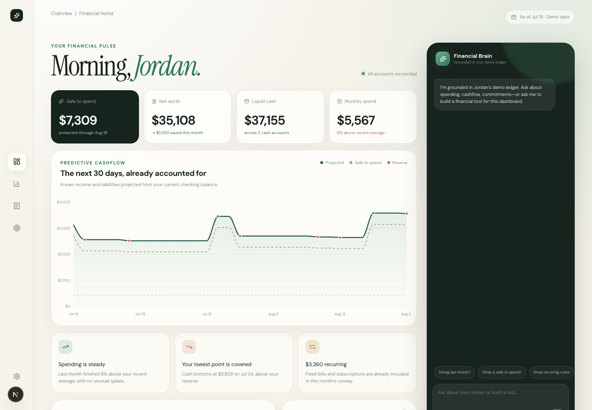
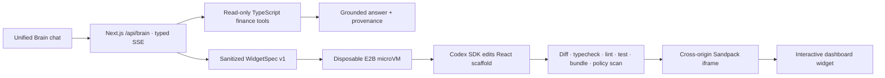

# FinDex — Financial OS

FinDex is a predictive, AI-native personal finance dashboard. It anticipates the next 30 days of cashflow, answers questions from a deterministic mock ledger, and can add a custom interactive React tool to the dashboard without a page reload.

The public demo is intentionally single-user and uses only generated US/USD data. It never asks for bank credentials, creates financial transactions, or presents model-generated calculations as financial truth.


## The four demo flows

1. **Rich deterministic ledger** — 12 months, 576 posted transactions, three reconciled accounts, linked transfers, recurring income and liabilities, and no empty states.
2. **Predictive cashflow** — a tested 30-day checking projection and a protected safe-to-spend headline derived from the lowest balance in the window.
3. **Financial Brain** — a typed SSE chat endpoint that delegates all currency calculations to read-only TypeScript tools.
4. **Generative UI Factory** — a strict `WidgetSpec` becomes React code in a disposable E2B/Codex workspace, passes validation, and renders in Sandpack without navigation.

The frozen acceptance prompt is:

> How much did I spend on dining out last month?

FinDex answers **$366.21 across 8 Dining transactions, June 1–30, 2026**, with a deterministic comparison to May.

## Product preview




## Architecture



The layers have deliberately different responsibilities:

| Layer | Responsibility |
| --- | --- |
| Finance engine | Integer-cent aggregation, transfer exclusion, recurrence expansion, forecast, and safe-to-spend math |
| OpenAI Responses API | Select the appropriate read-only tool and explain its returned result |
| Codex SDK in E2B | Write or repair `GeneratedWidget.tsx` from a sanitized spec and filtered mock data |
| E2B | Provide a disposable workspace, validation commands, deadline, and guaranteed cleanup |
| Sandpack | Compile and hot-render the validated browser artifact in a cross-origin iframe |
| Verified sample | Keep the demo useful during missing credentials, timeout, or validation failure; always visibly labeled |

## Stack

- Next.js 16 App Router, React 19, strict TypeScript
- Tailwind CSS v4, Radix primitives, Lucide, Recharts 3
- OpenAI Responses API with strict function schemas
- `@openai/codex-sdk` inside a versioned E2B template
- Sandpack for lazy-loaded browser compilation
- Zod, Vitest, Testing Library, and Playwright
- Imported static JSON for zero-latency, Vercel-compatible demo storage

## Local setup

Requirements: Node.js 22.13+ and npm.

```bash
npm install
cp .env.example .env.local
npm run dev
```

Open [http://localhost:3000](http://localhost:3000) and choose **Login as Demo User**. The dashboard and deterministic Brain flows work without API credentials. With live widgets disabled or unavailable, FinDex uses the labeled verified FIRE fixture.

For browser tests, install Chromium once:

```bash
npx playwright install chromium
```

## Environment

All credentials remain server-only. No variable uses a `NEXT_PUBLIC_` prefix.

| Variable | Purpose |
| --- | --- |
| `OPENAI_API_KEY` | Responses API and Codex client credential |
| `E2B_API_KEY` | Creates and destroys disposable widget sandboxes |
| `E2B_TEMPLATE` | Versioned template name or ID |
| `OPENAI_CHAT_MODEL` | Brain model; defaults to `gpt-5.6-terra` |
| `CODEX_MODEL` | Widget coding model; defaults to `gpt-5.3-codex` |
| `DEMO_AS_OF` | Fixture date used when regenerating data |
| `DEMO_SEED` | Deterministic seed |
| `DEMO_SESSION_SECRET` | HMAC secret for anonymous demo sessions |
| `ENABLE_LIVE_WIDGETS` | Set `false` to force the verified sample path |

## Data and finance invariants

The generator accepts explicit seed and date inputs:

```bash
npm run seed -- --seed findex-2026 --as-of 2026-07-19
```

The committed `data/demo-data.json` contains stable IDs shared across accounts, merchants, categories, recurring rules, and transactions. Money is signed integer cents; dates are ISO date-only values. Each seed run asserts:

- account balance reconciliation;
- referential integrity and unique transaction IDs;
- at least 12 monthly buckets and 450 posted transactions;
- balanced two-sided transfers;
- previous-calendar-month dining coverage and the frozen expected total;
- available future cash liabilities.

Transfers and credit-card payments affect cash balances but are excluded from income/spending totals. The forecast expands checking-impacting recurrences through day 30:

```text
projected balance = current checking + cumulative known income − cumulative cash liabilities
daily safe to spend = max(0, projected balance − $1,500 reserve)
headline safe to spend = minimum daily safe-to-spend value across the 30-day window
```

## Financial Brain contract

`POST /api/brain` accepts a signed anonymous session and bounded history, then streams:

- `status`: `thinking`, `querying`, `sandboxing`, `coding`, `validating`, `rendering`
- `text_delta`
- `tool_result` with provenance
- `widget`
- recoverable `error`

Strict read-only tools are `get_spending_summary`, `compare_spending_periods`, `list_recurring_obligations`, `get_cashflow_forecast`, `get_financial_snapshot`, and `request_widget`. Relative time resolves against the fixture’s `2026-07-19` as-of date in `America/New_York`; “last month” is the previous calendar month.

Public controls cap prompts at 500 characters, Brain turns at 25, and widget generations at three per signed anonymous session.

## Generative UI safety boundary

The route converts build intent into `WidgetSpec v1`; raw conversation text is not sent to the coding agent. The data envelope contains aggregates, forecast points, recurring obligations, and at most 100 purpose-filtered mock transactions. It strips account IDs and unrelated fields.

Codex can edit only `GeneratedWidget.tsx` and its optional test. Artifacts may import React, Recharts, and `./widget-kit`. Validation rejects unexpected files, source over 25 KB, invalid TypeScript, lint/test/bundle failures, network APIs, dynamic imports, `eval`, `Function`, parent-window access, unsafe HTML, scripts, and iframes. One repair turn is allowed. The route has a 120-second cap, generation has a 90-second deadline, and sandbox destruction runs in `finally` for success, failure, abort, and timeout.

### Build the E2B template

Authenticate E2B, set `E2B_API_KEY`, then run:

```bash
E2B_TEMPLATE=findex-codex-widget:v1 npm run e2b:template
```

The template extends E2B’s Codex image, installs the exact React/TypeScript/test toolchain, and commits a clean Git baseline. Set the resulting template name or ID in Vercel.

## Verification

```bash
npm run typecheck
npm run lint
npm test
npm run test:e2e
npm run build
```

The suite covers seed and reference integrity, integer cents, transfer exclusion, previous calendar months, leap-year/month-end recurrence, forecast deltas, reserve protection, exact Brain tool mapping, bounded prompts, filtered widget data, banned artifact APIs, labeled fallback behavior, desktop login, 390px layout, streamed provenance, no-reload insertion, and artifact persistence.

Live OpenAI/E2B smoke tests are intentionally separate because they consume external services. Use the checklist in [docs/DEMO_RUNBOOK.md](docs/DEMO_RUNBOOK.md) before the final deployment.

## Vercel deployment

1. Import the public repository into Vercel.
2. Add every value from `.env.example` in Project Settings; replace the session secret.
3. Use Node.js 22 and the standard `npm run build` command.
4. Confirm the selected Vercel plan permits the route’s `maxDuration = 120` requirement.
5. Run the deployed smoke checks, then freeze the commit at least two hours before judging.

Static JSON is intentional: Vercel functions do not provide durable local SQLite storage. Successful artifacts persist only in versioned browser `localStorage`; keys and sandbox identifiers never do.

## Limits

FinDex is a hackathon demo, not a financial institution or financial-advice system. It has no real authentication, bank connection, multi-user database, transaction capability, arbitrary backend execution, or production handling of personal financial data. Real-data production use would require audited schemas, stronger isolation, consent and deletion flows, durable encrypted storage, and a separately hosted network-denied renderer.

## License

[MIT](LICENSE)
