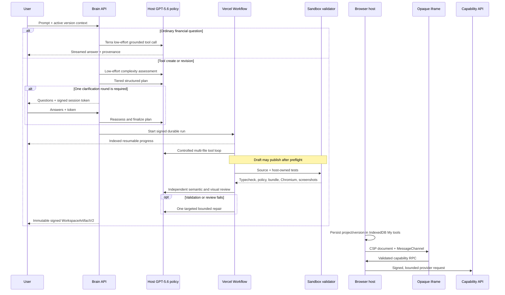

# Architecture

## Product shape

FinDex is a Brain-first personal finance demo. Users enter via **Try the demo**, land on the Financial Brain, and move through Spending, Portfolio, and Cash flow under one shell. The Brain supports Ask / Decide / Build: grounded answers, purchase stress tests, and durable generation of custom tools saved in **My tools**.

Cross-cutting UI concerns live in the dashboard shell: page-aware Brain guidance, Ask-the-Brain handoffs, view transitions between money views, and shared navigation (desktop complementary nav + mobile bottom bar).

## Repository boundaries

| Path | Responsibility |
| --- | --- |
| `app/` | Next.js pages, global styling, metadata, and server API route entry points |
| `components/brand/` | Brand wordmark |
| `components/brain/` | Financial Brain conversation, guidance/help, handoff banner, streamed build progress |
| `components/dashboard/` | Landing gate, Brain-first routed shell, Spending / Portfolio / Cash Flow views |
| `components/workspaces/` | My tools library, artifact presentation, and isolated runtime host |
| `lib/finance/` | Deterministic ledger, forecasts, dates, types, and integrity rules |
| `lib/brain/` | Public Brain request/SSE contracts, navigation helpers, guidance copy |
| `lib/workspaces/` | Planning, generation, policy, sandbox adapters, artifacts, signing, persistence, providers, quotas, and capability schemas |
| `infrastructure/workspace-sandbox/` | Versioned source template used to create and exercise Vercel Sandbox snapshots |
| `scripts/` | Deterministic data, screenshot, and sandbox snapshot operations |
| `tests/unit/` | Pure domain, schema, policy, normalization, signing, quota, and messaging contracts |
| `tests/integration/` | API, persistence, and local sandbox boundary tests |
| `tests/e2e/` | User-visible desktop and mobile Playwright flows + messaging screenshot goldens |
| `tests/evaluations/` | Credential-gated Sol corpus and live provider release checks |
| `workflows/` | Durable tool generation, validation, review, repair, and publication orchestration |
| `docs/` | Architecture, security, testing, and runbooks (agent planning under `docs/superpowers/` is gitignored) |

Dependency direction is inward: UI and API routes depend on `lib` contracts and services; `lib` never depends on components or route modules. The sandbox template is host-owned infrastructure and cannot be edited by generated code.

## Workspace build lifecycle

## Core contracts

- `BuildComplexityAssessment` determines host-enforced effort, time, and repair limits.
- `WorkspaceBuildPlan` is the structured source of truth for inputs, outputs, state, capabilities, disclosures, and acceptance criteria.
- `WorkspaceArtifactV2` is an immutable, content-addressed publication containing lineage, source, bundle, manifest, validation, review, provenance, and `qualityTier` (`draft` | `verified`).
- `CapabilityGrant` is represented by a signed, session- and artifact-bound token; the token never enters the iframe.
- `WorkspaceValidationReport` records every host validation plus the independent model review.
- Signed run access tokens bind resumable status, events, and cancellation to the exact anonymous session and run ID.
- `DemoDataset` schema v2 and pure finance selectors are the only source for core-page and grounded Brain numeric claims.
- Typed `insight_card` events carry a conclusion, metrics, assumptions, provenance, and a related routed view.
- `lib/brain/guidance.ts` owns page-aware Ask / Decide / Build copy and suggestion chips used by the shell.

Model selection and timeouts are host policy rather than plan output. Terra handles ordinary work, Sol handles complex work and independent review, and only measured source or semantic failures can trigger the single repair pass. See [Financial Brain workspace builds](FINANCIAL_BRAIN_BUILDS.md) for the exact matrix and durable run protocol.

## Persistence and versioning

Projects, immutable artifacts, compiled bundles, namespaced state, and the active durable-run cursor live in IndexedDB (surfaced as **My tools**). The durable record contains only run ID, signed access token, and last consumed event index and is deleted at terminal state. Only the active project identifier is stored in `localStorage`. A revision creates a child version, a restore copies the selected version into a new head, and a duplicate creates a new project with a newly signed artifact identity. No version is silently evicted.
